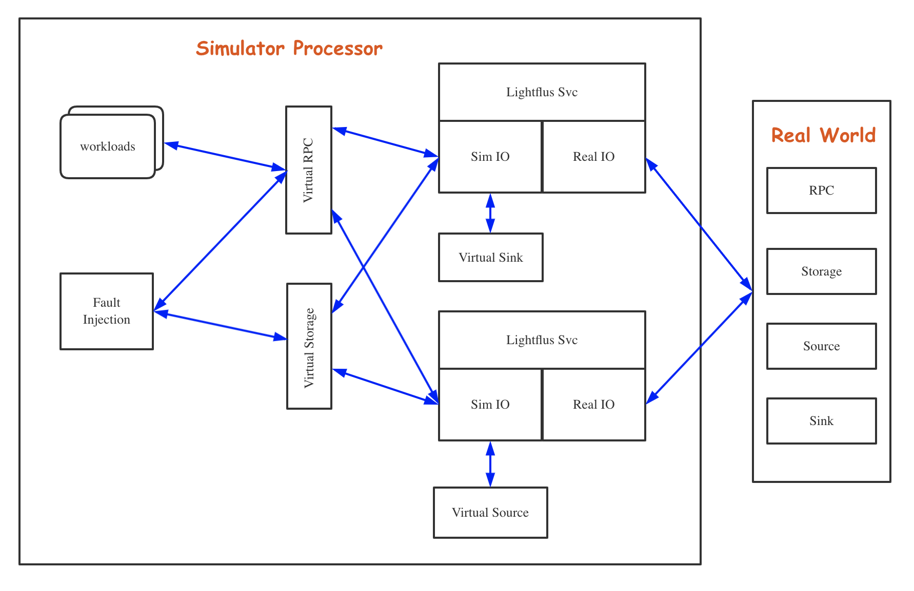

# Introduction

For a distributed system, we must ensure that even if there’re some unexpected exceptions happened, system is still working and the computed results is still right. ‘Everything is still under control’ is our first thing must to do.

Inspired by FoundationDB, [sled deterministic simulator](https://sled.rs/simulation.html) and [madsim](https://github.com/madsim-rs/madsim), I will develop a deterministic simulator for Lightflus. We can use this framework to augment Lightflus’s stability if something bad happens.

# Design

1. Lightflus can load two different IO interfaces with same name: Sim and Real
2. Sim IO interfaces will call a virtual RPC, storage object, source or sink;
3. workloads includes fault injection instructions, dataflow initialization, service configuration changes and direct message sender;
4. Fault Injection will make virtual layer to emit a specified exception;

# Q&A

There are some PROBLEMS we have to tackle at the beginning

## Q1
How to simulate nondeterminism source and communications  including network, disk, time in Lightflus without code effect?
### Answer
1. Rust provides a powerful package management tool Cargo. We can use cargo to replace some dependencies with our simulated one like rdkafka, tonic and tokio;
2. And we provide all modules we used in Lightflus to be abstract. They can inject any fault we want.

## Q2
How to spawn a Lightflus distributed service in one simulator processor?
### Answers
1. Lightflus instance (worker, apiserver, coordinator) can be initialized independently as a simple object.

## Q3
How to write cases and run them concurrently?

1. each case will be wrapped in a macro, and it will be ran in a tokio task;
2. cases will be joined until all of them are completed.

# Test Reports
